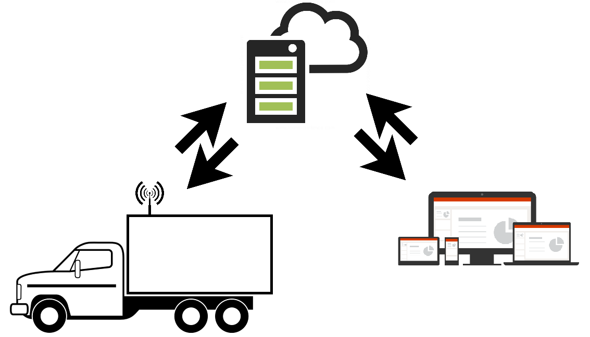
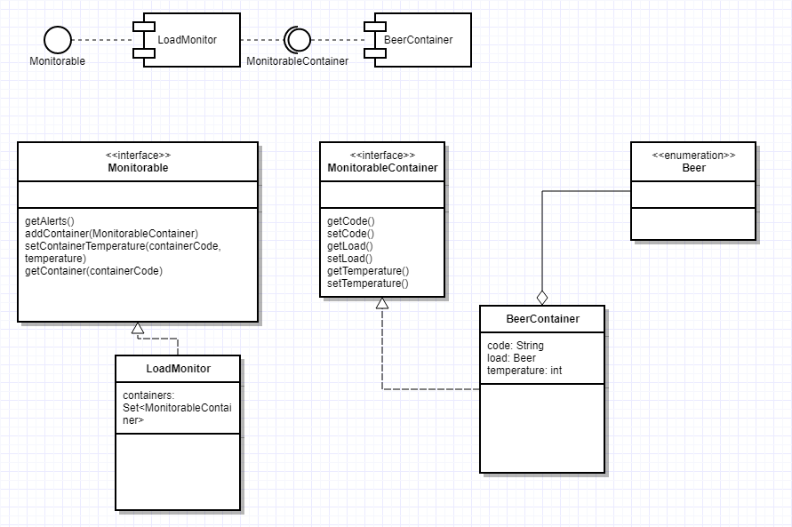
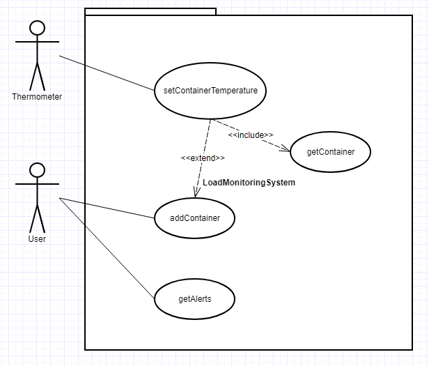

# PragmaBrewery Code Challenge

This application is part of a distributed system based on components and has been built using Java 1.8, ItelliJ IDEA and Maven.

## Overview:

Component diagram and Class diagram

Use Case diagram

## How to:

To run the tests: `mvn clean test`

To build the project (generate jar): `mvn clean package`

To run the application: `java -jar target/PragmaBrewery-0.1-SNAPSHOT.jar`

## Version notes:

This application version does not use database or any external dependency.

All the necessary data is stored in memory.

The report is displayed into the console.

There is an App.java class that will load the data and create the necessary assets.

### Questions to the client and Answers:

- Q. How big do you want your company? Do you already have a thought about how many trucks do you want your company to have and how will you monitor all containers temperature at the same time?
- A. I want to be big! I want to have a lot of trucks delivering my beer, but I also need a way to keep the quality of my product. In near future, I will need that someone else to be able to monitor the container's temperature besides the driver.

- Q. Shane, If it's possible (and not illegal) to keep someone inside the truck's fridge, what questions would you ask him? 
- A. If There's any container with inappropriate temperature? (getAlert) and what is the current temperature of each container and which is the Optimal temperature range?

- Q. The temperature provided by the thermometers is represented by integer numbers or fractional?
- A. Positive and negative Integers.

- Q. These containers have an identifier code, can you give me an example of it?
- A. Every container has an identifier code that looks like 035A.

### Code highlights:
- Based on components.
- Clean Code.
- TDD.
- Simple but easy to maintain and grow!

### Version 2.0 TODO:
- Encapsulate this module in a RestAPI (Spring) to allow service consumption from different ways and devices.
- Create methods with more detailed reports.
- Create Beer and Container CRUD.
- Introduce data base source and data base output.

### Author

**Ronaldo Regis (ronaldoregis)**

